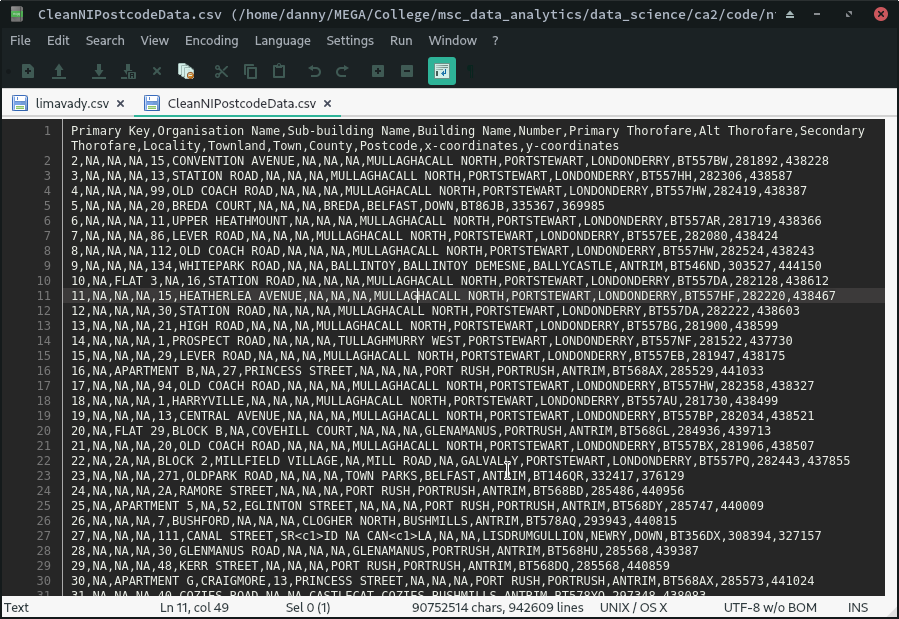
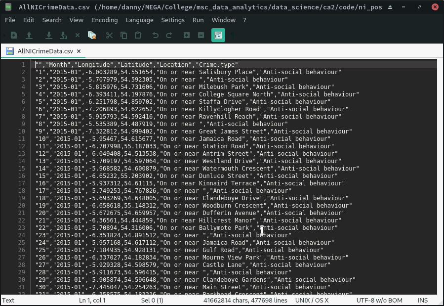

This page describes the methods used during and results obtained from the preparation and analysis of postcode and crime data for Northern Ireland. The postcode dataset is the focus of the first section, while the following section features the steps taken in analysing the crime dataset. 

Data files referenced throughout the document were present in a folder named `data` in the project working directory during the completion of this project.

`ni_postcodes_crime.Rmd` was rmarkdown file used to create the PDF documentation.

Required R packages: `collections`, `dplyr`, `plyr`, `stringr`, `VIM`

# NI Postcode Data
This section features a walkthrough of the steps taken during processing of the address data found in NIPostcodes.csv. The result of which will be used in the next section dealing with crime data. The associated code can is found in `ni_postcodes_data.R`.

a\) The first step is to load the NI postcodes dataset as a dataframe. The `describe_data()` function is then used to display the total number of records in the newly created dataframe, then shows the structure of the data and prints the first 10 rows.

```r
ni_postcodes <- read.csv("data/NIPostcodes.csv")
describe_data(ni_postcodes)
```

```
## 
## 
## ------------------
## Total rows:
## ------------------
## [1] 943033
## 
## 
## ------------------
## Dataframe structure:
## ------------------
## 'data.frame':	943033 obs. of  15 variables:
##  $ X                 : Factor w/ 40859 levels ""," ASCERT"," BALLYMAC HOTEL",...
##  $ X.1               : Factor w/ 6186 levels ""," APARMENT 1",..: 1 1 1 1 1 1 ..
##  $ X.2               : Factor w/ 12215 levels ""," "," I2 CIDO INNOVATION CEN"..
##  $ X17               : Factor w/ 5831 levels ""," 25C","?",..: 804 564 5076 13..
##  $ HIGH.ROAD         : Factor w/ 24540 levels "","ABBACY ROAD",..: 6072 21646 ..
##  $ X.3               : Factor w/ 453 levels "","\xc9ADAN CRAOIBHE",..: 1 1 1 1..
##  $ X.4               : Factor w/ 288 levels "","ABBEY ROAD",..: 1 1 1 1 1 1 1 ..
##  $ X.5               : Factor w/ 676 levels "","ABBEY BUSINESS PARK",..: 1 1 1..
##  $ MULLAGHACALL.NORTH: Factor w/ 7705 levels "ABBEY PARK","ABOCURRAGH",..: 614..
##  $ PORTSTEWART       : Factor w/ 314 levels "","AGHAGALLON",..: 271 271 271 46..
##  $ LONDONDERRY       : Factor w/ 6 levels "ANTRIM","ARMAGH",..: 5 5 5 3 5 5 5 ..
##  $ BT557BG           : Factor w/ 47931 levels "","BR925BN","BT00BT",..: 30877 ..
##  $ X281855           : int  281892 282306 282419 335367 281719 282080 282524 3..
##  $ X438598           : int  438228 438587 438387 369985 438366 438424 438243 4..
##  $ X1                : int  2 3 4 5 6 7 8 9 10 11 ...
## 
## 
## ------------------
## First 10 rows:
## ------------------
```

```
##    X    X.1 X.2 X17         HIGH.ROAD X.3 X.4       X.5 MULLAGHACALL.NORTH
## 1                15 CONVENTION AVENUE                   MULLAGHACALL NORTH
## 2                13      STATION ROAD                   MULLAGHACALL NORTH
## 3                99    OLD COACH ROAD                   MULLAGHACALL NORTH
## 4                20       BREDA COURT                                BREDA
## 5                11  UPPER HEATHMOUNT                   MULLAGHACALL NORTH
## 6                86        LEVER ROAD                   MULLAGHACALL NORTH
## 7               112    OLD COACH ROAD                   MULLAGHACALL NORTH
## 8               134    WHITEPARK ROAD         BALLINTOY  BALLINTOY DEMESNE
## 9    FLAT 3      16      STATION ROAD                   MULLAGHACALL NORTH
## 10               15 HEATHERLEA AVENUE                   MULLAGHACALL NORTH
##    PORTSTEWART LONDONDERRY BT557BG X281855 X438598 X1
## 1  PORTSTEWART LONDONDERRY BT557BW  281892  438228  2
## 2  PORTSTEWART LONDONDERRY BT557HH  282306  438587  3
## 3  PORTSTEWART LONDONDERRY BT557HW  282419  438387  4
## 4      BELFAST        DOWN  BT86JB  335367  369985  5
## 5  PORTSTEWART LONDONDERRY BT557AR  281719  438366  6
## 6  PORTSTEWART LONDONDERRY BT557EE  282080  438424  7
## 7  PORTSTEWART LONDONDERRY BT557HW  282524  438243  8
## 8  BALLYCASTLE      ANTRIM BT546ND  303527  444150  9
## 9  PORTSTEWART LONDONDERRY BT557DA  282128  438612 10
## 10 PORTSTEWART LONDONDERRY BT557HF  282220  438467 11
```

b\) The correct titles are then assigned to each column in the postcodes dataframe.

```r
ni_postcodes <- rename_columns(ni_postcodes)
```

```
## 
## 
## ------------------
## Before update:
## ------------------
##  [1] "X"                  "X.1"                "X.2"               
##  [4] "X17"                "HIGH.ROAD"          "X.3"               
##  [7] "X.4"                "X.5"                "MULLAGHACALL.NORTH"
## [10] "PORTSTEWART"        "LONDONDERRY"        "BT557BG"           
## [13] "X281855"            "X438598"            "X1"                
## 
## 
## ------------------
## After update:
## ------------------
##  [1] "Organisation Name"   "Sub-building Name"   "Building Name"      
##  [4] "Number"              "Primary Thorofare"   "Alt Thorofare"      
##  [7] "Secondary Thorofare" "Locality"            "Townland"           
## [10] "Town"                "County"              "Postcode"           
## [13] "x-coordinates"       "y-coordinates"       "Primary Key"
```

c\) Next comes the handling of missing data.

From visually inspecting the dataframe, there are a lot of empty cells. Replacing these with NA to get a clearer idea of what is missing

```r
ni_postcodes[ni_postcodes == ""] <- NA
```

VIM is used to get missing values and then print a summary of what is not there.

```r
missing_values <- aggr(ni_postcodes, 
                       prop = FALSE, 
                       numbers = TRUE, 
                       plot = FALSE)

missing_values[["missings"]]
```

```
##                                Variable  Count
## Organisation Name     Organisation Name 890536
## Sub-building Name     Sub-building Name 884098
## Building Name             Building Name 895539
## Number                           Number  28753
## Primary Thorofare     Primary Thorofare    470
## Alt Thorofare             Alt Thorofare 921787
## Secondary Thorofare Secondary Thorofare 938399
## Locality                       Locality 856788
## Townland                       Townland      0
## Town                               Town  19872
## County                           County      0
## Postcode                       Postcode   8900
## x-coordinates             x-coordinates      0
## y-coordinates             y-coordinates      0
## Primary Key                 Primary Key      0
```
Missing values of note are Town (19,872) and Postcode (8,900)

Rows with either Town or Postcode missing will be removed because ambiquity is introduced if a record has either of these not present.

```r
ni_postcodes <- ni_postcodes[!(is.na(ni_postcodes$Town) | 
                                 is.na(ni_postcodes$Postcode)),]
```

d\) After ignoring rows with a missing town or postcode value, the missing value counts for the dataframe is as follows:

```r
missing_values_after_removal <- aggr(ni_postcodes, 
                                     prop = FALSE, 
                                     numbers = TRUE, 
                                     plot = FALSE)

missing_values_after_removal[["missings"]]
```

```
##                                Variable  Count
## Organisation Name     Organisation Name 863211
## Sub-building Name     Sub-building Name 857213
## Building Name             Building Name 868922
## Number                           Number  27030
## Primary Thorofare     Primary Thorofare    438
## Alt Thorofare             Alt Thorofare 893543
## Secondary Thorofare Secondary Thorofare 910093
## Locality                       Locality 848692
## Townland                       Townland      0
## Town                               Town      0
## County                           County      0
## Postcode                       Postcode      0
## x-coordinates             x-coordinates      0
## y-coordinates             y-coordinates      0
## Primary Key                 Primary Key      0
```

Rows with NA for Town or Postcode are removed.

Total rows after cleaning:

```r
nrow(ni_postcodes)
```

```
## [1] 914687
```

e\) The primary key column is to be moved from the last position in the dataframe to the first with the `move_primary_key` function. The before and after order of columns is displayed below.

```r
ni_postcodes <- move_primary_key(ni_postcodes)
```

```
## 
## 
## ------------------
## Columns before reorder:
## ------------------
##  [1] "Organisation Name"   "Sub-building Name"   "Building Name"      
##  [4] "Number"              "Primary Thorofare"   "Alt Thorofare"      
##  [7] "Secondary Thorofare" "Locality"            "Townland"           
## [10] "Town"                "County"              "Postcode"           
## [13] "x-coordinates"       "y-coordinates"       "Primary Key"        
## 
## 
## ------------------
## Columns after reorder:
## ------------------
##  [1] "Primary Key"         "Organisation Name"   "Sub-building Name"  
##  [4] "Building Name"       "Number"              "Primary Thorofare"  
##  [7] "Alt Thorofare"       "Secondary Thorofare" "Locality"           
## [10] "Townland"            "Town"                "County"             
## [13] "Postcode"            "x-coordinates"       "y-coordinates"
```

f\) A dataframe is then created containing only postcode records where the locality, townland or town contains Limavady. In the `extract_limavady_data()` function used to achieve this, the number of rows in the new dataframe is displayed and then the data is written to a csv file.

```r
limavady_data <- extract_limavady_data(ni_postcodes)
```

```
## 
## 
## ------------------
## Limavady dataset row count:
## ------------------
## [1] 8455
```

<div class="figure" style="text-align: center">

<p class="caption">Figure 1: limavady.csv</p>
</div>

g\) Finally, the cleaned NI postcode dataframe is written to a csv file, ready for analysis.

```r
write.csv(ni_postcodes, "data/CleanNIPostcodeData.csv")
```

<div class="figure" style="text-align: center">

<p class="caption">Figure 2: CleanNIPostcodeData.csv</p>
</div>

# NI Crime Data
The crime data contained in each of the monthly NI crime data csv files is the focus of this section. The code used here can be found in the `ni_crime_data.R` file on Github. The data from the individual csv files is combined into one dataset, cleaned and population and town values are looked up from the VillageList.csv dataset and the previously cleaned postcode dataset respectively. Visualisations of crime rates are also generated for this portion of the project.

a\) In the `combine_crime_data` function all data from the monthly crime report files are combined into a single dataframe, this dataframe is written to the AllNICrimeData.csv file (see Figure 3) and the total number of records is printed.

```r
crime_data <- combine_crime_data("data/NI Crime Data/")
```

```
## 
## 
## ------------------
## Crime data files:
## ------------------
## 
## 
## ------------------
## Crime dataframe:
## ------------------
##   Crime.ID   Month                        Reported.by
## 1          2015-01 Police Service of Northern Ireland
## 2          2015-01 Police Service of Northern Ireland
## 3          2015-01 Police Service of Northern Ireland
## 4          2015-01 Police Service of Northern Ireland
## 5          2015-01 Police Service of Northern Ireland
##                         Falls.within Longitude Latitude
## 1 Police Service of Northern Ireland -6.003289 54.55165
## 2 Police Service of Northern Ireland -5.707979 54.59231
## 3 Police Service of Northern Ireland -5.815976 54.73161
## 4 Police Service of Northern Ireland -6.393411 54.19788
## 5 Police Service of Northern Ireland -6.251798 54.85970
##                          Location LSOA.code LSOA.name            Crime.type
## 1      On or near Salisbury Place        NA        NA Anti-social behaviour
## 2                     On or near         NA        NA Anti-social behaviour
## 3        On or near Milebush Park        NA        NA Anti-social behaviour
## 4 On or near College Square North        NA        NA Anti-social behaviour
## 5         On or near Staffa Drive        NA        NA Anti-social behaviour
##   Last.outcome.category Context
## 1                    NA      NA
## 2                    NA      NA
## 3                    NA      NA
## 4                    NA      NA
## 5                    NA      NA
## 
## 
## ------------------
## Total rows:
## ------------------
## [1] 477696
```

<div class="figure" style="text-align: center">

<p class="caption">Figure 3: Initial AllNICrimeData.csv</p>
</div>

b\) Modifying the crime dataframe so that CrimeID, Reported by, Falls within, LSOA code, LSOA name, last outcome and context are excluded. New structure is saved to a csv file, displayed in Figure 4.

```r
crime_data <- modify_crime_data_structure(crime_data, 
                                          remove_columns = c("Crime.ID", 
                                                             "Reported.by", 
                                                             "Falls.within", 
                                                             "LSOA.code", 
                                                             "LSOA.name",
                                                             "Last.outcome.category", 
                                                             "Context"),
                                          file_name = "data/AllNICrimeData.csv")
```

```
## 
## 
## ------------------
## Existing crime dataframe structure:
## ------------------
## 'data.frame':	477696 obs. of  12 variables:
##  $ Crime.ID             : chr  "" "" "" "" ...
##  $ Month                : chr  "2015-01" "2015-01" "2015-01" "2015-01" ...
##  $ Reported.by          : Factor w/ 1 level "Police Service of Northern Irela"..
##  $ Falls.within         : Factor w/ 1 level "Police Service of Northern Irela"..
##  $ Longitude            : num  -6 -5.71 -5.82 -6.39 -6.25 ...
##  $ Latitude             : num  54.6 54.6 54.7 54.2 54.9 ...
##  $ Location             : chr  "On or near Salisbury Place" "On or near " "On"..
##  $ LSOA.code            : logi  NA NA NA NA NA NA ...
##  $ LSOA.name            : logi  NA NA NA NA NA NA ...
##  $ Crime.type           : Factor w/ 14 levels "Anti-social behaviour",..: 1 1 ..
##  $ Last.outcome.category: logi  NA NA NA NA NA NA ...
##  $ Context              : logi  NA NA NA NA NA NA ...
## 
## 
## ------------------
## New crime dataframe structure:
## ------------------
## 'data.frame':	477696 obs. of  7 variables:
##  $ Month                : chr  "2015-01" "2015-01" "2015-01" "2015-01" ...
##  $ Longitude            : num  -6 -5.71 -5.82 -6.39 -6.25 ...
##  $ Latitude             : num  54.6 54.6 54.7 54.2 54.9 ...
##  $ Location             : chr  "On or near Salisbury Place" "On or near " "On"..
##  $ Crime.type           : Factor w/ 14 levels "Anti-social behaviour",..: 1 1 ..
```

<div class="figure" style="text-align: center">

<p class="caption">Figure 4: Modified AllNICrimeData.csv</p>
</div>

c\) Abbreviate text for each crime type:

```r
crime_data <- abbreviate_crime_types(crime_data)
```

```
## 
## 
## ------------------
## Non-abbreviated crime types:
## ------------------
##  [1] Anti-social behaviour        Bicycle theft               
##  [3] Burglary                     Criminal damage and arson   
##  [5] Drugs                        Other theft                 
##  [7] Possession of weapons        Public order                
##  [9] Robbery                      Shoplifting                 
## [11] Theft from the person        Vehicle crime               
## [13] Violence and sexual offences Other crime                 
## 14 Levels: Anti-social behaviour Bicycle theft ... Violence and sexual offences
## 
## 
## ------------------
## Abbreviated crime types:
## ------------------
##  [1] ASBO BITH BURG CDAR DRUG OTTH POW  PUBO ROBY SHOP THPR VECR VISO OTCR
## 14 Levels: ASBO BITH BURG CDAR DRUG OTCR OTTH POW PUBO ROBY SHOP THPR ... VISO
```

d\) Plot the frequency of each crime type across all of Northern Ireland. 

```r
plot_crime_frequency(crime_data)
```

<div class="figure" style="text-align: center">

<p class="caption">Figure 5: Northern Ireland Crime Rates</p>
</div>

It is evident from the chart that anti-social behaviour (ASBO) is the most prevalent crime category throughout the country by  quite a margin. Recorded instances total close to 180,000 whereas the next highest crime type is Violence and sexual offences (VISO) with around 110,000 occurrences

e\) Cleaning up the location column by removing "On or near ", leaving only the street name. A sample of the data before updating:

```r
head(crime_data, n = 5)
```

```
##     Month Longitude Latitude                        Location Crime.type
## 1 2015-01 -6.003289 54.55165      On or near Salisbury Place       ASBO
## 2 2015-01 -5.707979 54.59231                     On or near        ASBO
## 3 2015-01 -5.815976 54.73161        On or near Milebush Park       ASBO
## 4 2015-01 -6.393411 54.19788 On or near College Square North       ASBO
## 5 2015-01 -6.251798 54.85970         On or near Staffa Drive       ASBO

```

Using `str_replace` from the `stringr` package to remove unwanted text and replace blank values with NA.  

```r
crime_data$Location <- str_replace(crime_data$Location, pattern = "On or near ", "")
crime_data$Location[crime_data$Location == ""] <- NA
```

After the update:

```r
head(crime_data, n = 5)
```

```
##     Month Longitude Latitude             Location Crime.type
## 1 2015-01 -6.003289 54.55165      Salisbury Place       ASBO
## 2 2015-01 -5.707979 54.59231                 <NA>       ASBO
## 3 2015-01 -5.815976 54.73161        Milebush Park       ASBO
## 4 2015-01 -6.393411 54.19788 College Square North       ASBO
## 5 2015-01 -6.251798 54.85970         Staffa Drive       ASBO
```

\newpage
f\) The next step is to find the town in which crimes have occured. The cleaned NI Postcode data will be used to achieve this so the data is loaded from the previously created csv.

```r
ni_postcodes <- read.csv("data/CleanNIPostcodeData.csv")
```

A random sample of 5,000 crime records is taken using the `dplyr` package with filter conditions  included to ignore NA or "No Location" values in the dataset. A seed is set to allow for reproducible results.

```r
set.seed(100)
random_crime_sample <- crime_data %>%
  filter(!is.na(crime_data$Location) & crime_data$Location != "No Location") %>%
  sample_n(5000)
head(random_crime_sample, n = 5)
```

```
##     Month Longitude Latitude             Location Crime.type
## 1 2015-08 -6.677198 55.13192 Captain Street Lower       ASBO
## 2 2017-06 -5.934686 54.59637        Murray Street       ASBO
## 3 2016-03 -5.925699 54.57408       Annadale Green       ASBO
## 4 2015-08 -6.770961 54.50335        Scotch Street       VISO
## 5 2016-07 -5.962626 54.60889          Bray Street       ASBO
```

The `find_a_town` function assigns a town to each of the sample records by checking the crime Location column against the postcode Primary Thorofare. 

```r
random_crime_sample <- find_a_town(random_crime_sample, ni_postcodes)
```

```
## 
## 
## ------------------
## Town Included:
## ------------------
##     Month Longitude Latitude             Location Crime.type      Town
## 1 2015-08 -6.677198 55.13192 Captain Street Lower       ASBO COLERAINE
## 2 2017-06 -5.934686 54.59637        Murray Street       ASBO   BELFAST
## 3 2016-03 -5.925699 54.57408       Annadale Green       ASBO   BELFAST
## 4 2015-08 -6.770961 54.50335        Scotch Street       VISO DUNGANNON
## 5 2016-07 -5.962626 54.60889          Bray Street       ASBO   BELFAST
```
g\) The `add_town_data` function was created to assign population values to each crime record. Population come from the VillageList.csv file:

```r
village_data <- read.csv("data/VillageList.csv")
```

In the `village_data` dataframe Derry is listed as Derry rather than Londonderry so that is updated in the sample dataset.

```r
random_crime_sample$Town <- as.character(random_crime_sample$Town)
random_crime_sample$Town[random_crime_sample$Town == "LONDONDERRY"] <- "DERRY"
```

Matching population figures are assigned to crime records based on the town they occured in.

```r
random_crime_sample <- add_town_data(random_crime_sample, village_data)
```

```
## 
## 
## ------------------
## Population Included:
## ------------------
##     Month Longitude Latitude             Location Crime.type      Town
## 1 2015-08 -6.677198 55.13192 Captain Street Lower       ASBO COLERAINE
## 2 2017-06 -5.934686 54.59637        Murray Street       ASBO   BELFAST
## 3 2016-03 -5.925699 54.57408       Annadale Green       ASBO   BELFAST
## 4 2015-08 -6.770961 54.50335        Scotch Street       VISO DUNGANNON
## 5 2016-07 -5.962626 54.60889          Bray Street       ASBO   BELFAST
## 6 2017-08 -7.314481 54.60381        Gortmore Park       ASBO   LISBURN
##   Population
## 1     24,694
## 2    335,665
## 3    335,665
## 4     15,987
## 5    335,665
## 6    121,654
```

h\) As per the requirements the columns required in the final dataset are Month, Longitude, Latitude, Location, Crime type, City-Town-Village and Population. To achieve this, the Town column must be renamed. The result of this is saved to a csv file, a sample of which is displayed below the code output.

```r
colnames(random_crime_sample)[
  colnames(random_crime_sample) == "Town"] <- "City-Town-Village"
write.csv(random_crime_sample, "data/random_crime_sample.csv")
```

<div class="figure" style="text-align: center">

<p class="caption">Figure 6: CSV file containing random sample of crime data.</p>
</div>

i\) Finally, crime rates in Derry compared to Belfast are plotted. New dataframes containing only from crimes each of the cities are created:

```r
derry_data <- random_crime_sample[
  which(random_crime_sample$"City-Town-Village" == "DERRY"), ]
belfast_data <- random_crime_sample[
  which(random_crime_sample$"City-Town-Village" == "BELFAST"), ]
```

Derry data:

```r
head(derry_data)
```

```
##      Month Longitude Latitude         Location Crime.type City-Town-Village
## 20 2017-07 -7.305278 55.03020     Earhart Park       ASBO             DERRY
## 26 2017-07 -7.219467 55.02969     Clooney Road       VISO             DERRY
## 46 2015-11 -7.318992 54.99525 Newmarket Street       ASBO             DERRY
## 52 2017-11 -7.314768 55.02488  Racecourse Road       SHOP             DERRY
## 68 2016-05 -7.327385 54.99504       Lecky Road       CDAR             DERRY
## 81 2015-05 -7.328032 55.00309     Academy Road       VISO             DERRY
##    Population
## 20     87,269
## 26     87,269
## 46     87,269
## 52     87,269
## 68     87,269
## 81     87,269
```

Belfast data:

```r
head(belfast_data)
```

```
##      Month Longitude Latitude        Location Crime.type 
## 2  2017-06 -5.934686 54.59637   Murray Street       ASBO                    
## 3  2016-03 -5.925699 54.57408  Annadale Green       ASBO                    
## 5  2016-07 -5.962626 54.60889     Bray Street       ASBO                    
## 9  2015-10 -5.928756 54.60191 Donegall Street       VISO                    
## 10 2016-07 -5.927049 54.61298   Glenrosa Link       ASBO                    
## 22 2017-01 -5.954282 54.59934   Clonard Place       ASBO                    
##     City-Town-Village Population
## 2             BELFAST    335,665
## 3             BELFAST    335,665
## 5             BELFAST    335,665
## 9             BELFAST    335,665
## 10            BELFAST    335,665
## 22            BELFAST    335,665
```
Then the data is plotted using `plot_derry_belfast_crime`, displaying two bar charts side-by-side. The `xlim` parameter was used to scale each of the graphs to give a proper visual comparison of crime figures.


```r
plot_derry_belfast_crime(derry_data, belfast_data)
```

<div class="figure" style="text-align: center">

<p class="caption">Figure 7: Derry vs Belfast Crime Rates</p>
</div>

Occurrences of all crime types have are higher in Belfast which is expected given the difference in population of the two cities. According to the data in VillageList.csv, Belfast has 	335,665 residents while Derry has a population of 87,269.
