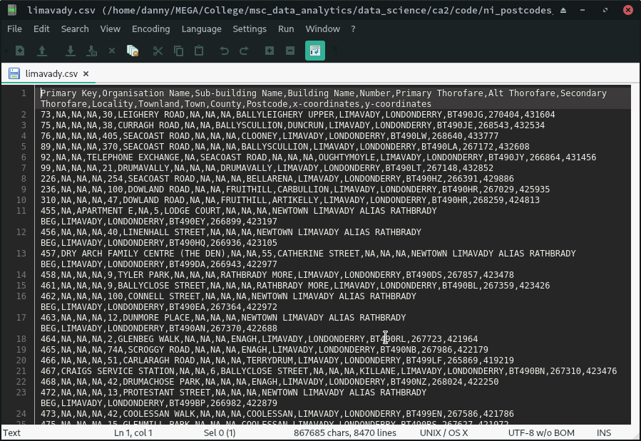

```{r, include=FALSE}
source("ni_postcodes_data.R")
```

This document describes the methods used during and results obtained from analysis of postcode and crime data for Northern Ireland. The postcode dataset is the focus of the first section, while the next section features the steps taken in analysing the crime dataset.

# NI Postcode Data
\noindent\makebox[\linewidth]{\rule{\textwidth}{0.4pt}}
a\) Show the Total number of rows, the structure of the data frame, and first 10 rows of the data frame containing all of the NI Postcode data.
```{r}
ni_postcodes <- read.csv("data/NIPostcodes.csv")
describe_data(ni_postcodes)
```
\noindent\makebox[\linewidth]{\rule{\textwidth}{0.4pt}}

b\) Add a suitable title for each attribute of the data.
```{r}
ni_postcodes <- rename_columns(ni_postcodes)
```
\noindent\makebox[\linewidth]{\rule{\textwidth}{0.4pt}}

\newpage
c\) Remove or replace missing entries with a suitable identifier.

From inspecting the dataframe, there are a lot of empty cells. Replacing these with NA to get a clearer idea of what is missing
```{r}
ni_postcodes[ni_postcodes == ""] <- NA
```

Use VIM to get missing values and then print summary
```{r}
missing_values <- aggr(ni_postcodes, 
                       prop = FALSE, 
                       numbers = TRUE, 
                       plot = FALSE)

missing_values[["missings"]]
```
Missing values of note are Town (19872) and Postcode (8900)

Rows with both Town and Postcode missing will be removed because it introduces too much abiquity for a record, if only Postcode is missing the row will be kept.
```{r}
ni_postcodes <- ni_postcodes[!(is.na(ni_postcodes$Town) & 
                                 is.na(ni_postcodes$Postcode)),]
```
\noindent\makebox[\linewidth]{\rule{\textwidth}{0.4pt}}

\newpage
d\) Show the total number of missing values for each column in the postcode data frame.
```{r}
missing_values_after_removal <- aggr(ni_postcodes, 
                                     prop = FALSE, 
                                     numbers = TRUE, 
                                     plot = FALSE)

missing_values_after_removal[["missings"]]
```

After the rows with NA for both Town and Postcode were removed 
The dataset now has 19446 records with Town missing in 19446 records with Postcode missing.

Total rows after cleaning:
```{r}
nrow(ni_postcodes)
```
\noindent\makebox[\linewidth]{\rule{\textwidth}{0.4pt}}

\newpage
e\) Move the primary key identifier to the start of the dataset.
```{r}
ni_postcodes <- move_primary_key(ni_postcodes)
```
\noindent\makebox[\linewidth]{\rule{\textwidth}{0.4pt}}

f\) Create a new dataset called Limavady_data. Store within it only information where locality, townland and town contain the name Limavady. Count and display the number of rows. Store this information in a csv file called Limavady.
```{r}
limavady_data <- extract_limavady_data(ni_postcodes)
```
{#id .class width=50% height=50%}
\noindent\makebox[\linewidth]{\rule{\textwidth}{0.4pt}}

\newpage
g\) Save the modified NIPostcode dataset in a csv file called CleanNIPostcodeData.
```{r}
write_csv(ni_postcodes, "data/CleanNIPostcodeData.csv")
```
{#id .class width=50% height=50%}
\noindent\makebox[\linewidth]{\rule{\textwidth}{0.4pt}}

Add a new chunk by clicking the *Insert Chunk* button on the toolbar or by pressing *Ctrl+Alt+I*.


When you save the notebook, an HTML file containing the code and output will be saved alongside it (click the *Preview* button or press *Ctrl+Shift+K* to preview the HTML file).

The preview shows you a rendered HTML copy of the contents of the editor. Consequently, unlike *Knit*, *Preview* does not run any R code chunks. Instead, the output of the chunk when it was last run in the editor is displayed.

# NI Crime Data
